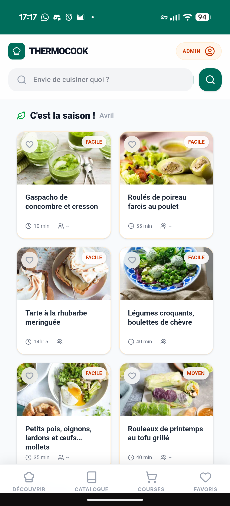
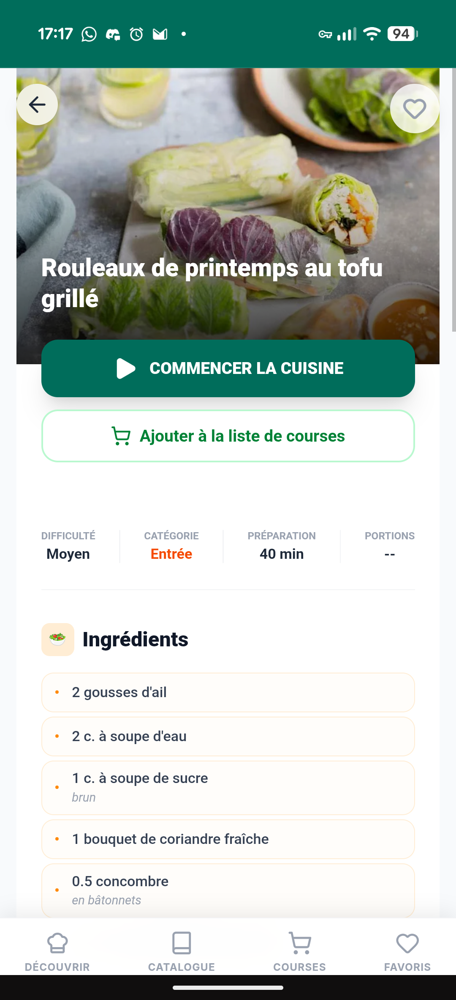
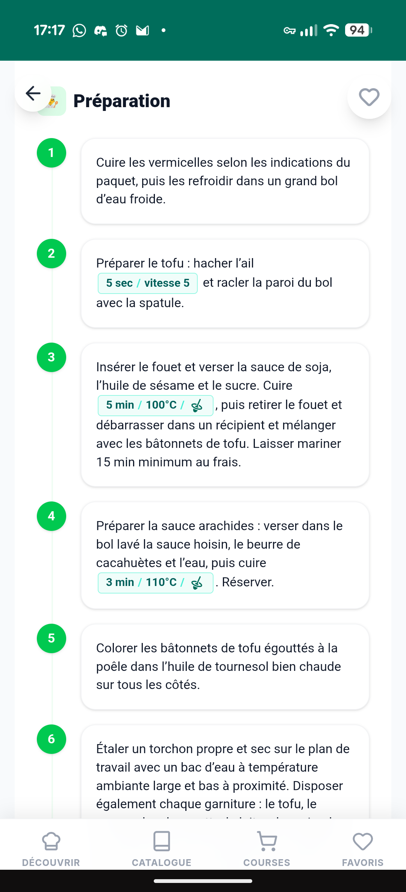
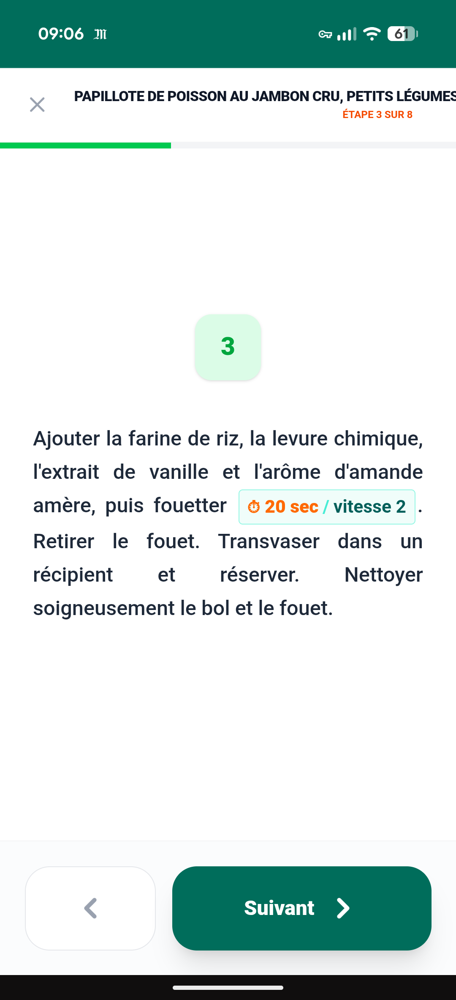
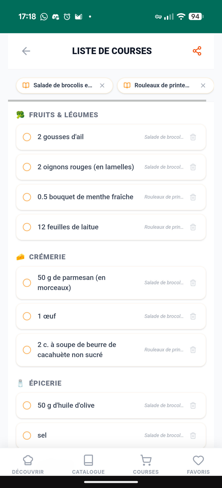
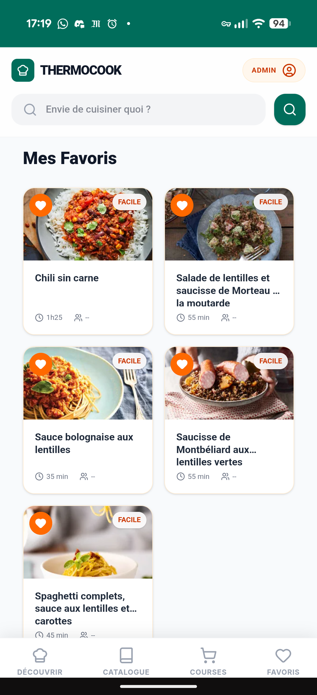

<div align="center">

# 🍳 ThermoCook


**Votre bibliothèque de recettes, auto-hébergée et taillée pour le Thermomix**

*Recherche instantanée. Mode cuisine tablette. Liste de courses partageable. Vos données vous appartiennent.*

[](https://fastapi.tiangolo.com/)
[](https://react.dev/)
[](https://www.postgresql.org/)
[](https://www.docker.com/)
[](https://web.dev/progressive-web-apps/)
[](https://opensource.org/licenses/ISC)

</div>

---

ThermoCook est un gestionnaire de recettes **auto-hébergé et respectueux de la vie privée**, conçu pour les propriétaires de Thermomix qui souhaitent s'affranchir des services cloud propriétaires.

Vos recettes vivent sur votre serveur, pas ailleurs. Pas d'abonnement. Pas d'enfermement propriétaire.

---

## Fonctionnalités

### 🔍 Découverte et recherche



La page d'accueil met en avant les recettes de saison. Une barre de recherche permet de retrouver n'importe quelle recette en quelques lettres — même avec une faute de frappe.

La navigation par onglets permet de basculer entre **Découvrir**, le **Catalogue** complet, les **Courses** et les **Favoris**.

<br clear="right"/>

---

### 📖 Fiche recette



Chaque recette affiche sa photo, sa difficulté, sa catégorie, son temps de préparation et le nombre de portions. Deux actions sont accessibles en un tap depuis la fiche :

- **Commencer la cuisine** — lance le Mode Cuisine pas à pas
- **Ajouter à la liste de courses** — ajoute les ingrédients à votre liste en cours

<br clear="right"/>

---

### 🍳 Étapes de préparation Thermomix



Les réglages Thermomix — température, vitesse, durée — apparaissent sous forme de pastilles colorées directement dans le texte de chaque étape. D'un coup d'œil, vous savez exactement quoi régler sur votre robot.

<br clear="right"/>

---

### 🎬 Mode Cuisine



Le Mode Cuisine affiche les étapes une par une, en grand, pour une lecture confortable à distance. Une barre de progression indique où vous en êtes dans la recette.

- L'écran de la tablette reste allumé pendant toute la préparation
- Les durées deviennent des minuteurs que vous lancez d'un tap
- Navigation avant/arrière entre les étapes

<br clear="right"/>

---

### 🛒 Liste de courses



Constituez votre liste de courses depuis les fiches recettes. Les ingrédients de plusieurs recettes sont regroupés automatiquement par rayon (Fruits & Légumes, Crémerie, Épicerie…).

Un bouton de partage génère un lien pour consulter la liste sur votre téléphone en magasin, sans avoir à ouvrir l'application.

<br clear="right"/>

---

### ❤️ Favoris



Ajoutez une recette à vos favoris en un tap. L'onglet **Favoris** rassemble toutes vos recettes sauvegardées pour les retrouver facilement.

<br clear="right"/>

---

### 📱 Installez l'application sur votre téléphone

ThermoCook s'installe depuis le navigateur sur votre téléphone ou tablette, comme une application classique. Les recettes déjà consultées restent accessibles même sans connexion.

---

## Démarrage rapide

**Prérequis :** Docker et Docker Compose.

```bash
# 1. Cloner le dépôt
git clone https://github.com/NimpNaw/thermocook.git
cd thermocook

# 2. Configurer l'environnement
cp .env.example .env
# Éditez .env — définissez au minimum SECRET_KEY, ADMIN_PASSWORD et vos identifiants de base de données

# 3. Lancer
docker compose up -d
```

| Service | URL |
|---|---|
| Application | `http://localhost:3000` |
| API (Swagger) | `http://localhost:8000/docs` |

ThermoCook démarre avec une bibliothèque de recettes vide. Voir [Ajouter des recettes](#ajouter-des-recettes) ci-dessous.

---

## Configuration

Toute la configuration se fait via des variables d'environnement dans votre fichier `.env`.

| Variable | Défaut | Description |
|---|---|---|
| `SECRET_KEY` | ⚠️ valeur dev | Secret JWT — **à changer en production** |
| `ADMIN_USERNAME` | `admin` | Nom d'utilisateur administrateur |
| `ADMIN_PASSWORD` | `changeme` | Mot de passe admin — **à changer en production** |
| `POSTGRES_USER` | — | Utilisateur PostgreSQL |
| `POSTGRES_PASSWORD` | — | Mot de passe PostgreSQL |
| `POSTGRES_DB` | — | Nom de la base de données PostgreSQL |
| `ALLOWED_ORIGINS` | `http://localhost:3000` | Origines CORS autorisées, séparées par des virgules |
| `AUTO_IMPORT` | `true` | Lance l'import des recettes au démarrage du backend |
| `COOKIE_SECURE` | `false` | Mettre à `true` pour servir en HTTPS |
| `BACKEND_PORT` | `8000` | Port exposé du backend |
| `FRONTEND_PORT` | `3000` | Port exposé du frontend |

> **Conseil proxy inverse :** Faites tourner ThermoCook derrière Nginx/Traefik/Caddy pour HTTPS. Définissez `COOKIE_SECURE=true` et `ALLOWED_ORIGINS` sur votre domaine public.

---

## Ajouter des recettes

ThermoCook est livré sans recettes. Chaque recette est un fichier Markdown dans `data/recipes/`.

### Structure des répertoires

```
data/recipes/
└── ma-source/
    └── gateau-chocolat/
        ├── recette.md
        └── images/
            └── principale.jpg
```

L'identifiant de la recette est dérivé du chemin : `{dossier_source}_{dossier_recette}` (ex. `ma-source_gateau-chocolat`). Renommer un dossier change son identifiant et supprime toutes les données utilisateur associées au prochain import.

### Format de `recette.md`

```markdown
# Fondant au Chocolat


**Difficulté :** Facile | **Temps total :** 30 min | **Portions :** 6 portions
**Catégorie :** Dessert

## Ingrédients

- 200 g de chocolat noir
- 150 g de beurre
- 4 œufs
- 120 g de sucre

## Préparation

**1.** Faire fondre le chocolat et le beurre. {5 min/50°C/vitesse 2}
**2.** Ajouter les œufs et le sucre, mélanger. {30 sec/vitesse 4}
**3.** Cuire à 180°C pendant 12 minutes.
```

### Notation Thermomix `{…}`

Les réglages Thermomix s'écrivent entre accolades : `{durée/température_ou_mode/vitesse}`

| Exemple | Signification |
|---|---|
| `{5 min/Varoma/vitesse 2}` | 5 min à Varoma, vitesse 2 |
| `{10 min/98°C/vitesse 1}` | 10 min à 98°C, vitesse 1 |
| `{30 sec/vitesse 10}` | 30 sec à vitesse 10 |
| `{5 min/pétrin}` | 5 min en mode pétrin |

**Modes supportés :** `pétrin`, `inverse`, `mijotage`, `turbo`, `Varoma`, `Épaissir`, `Mixage`, `Caramel`, `Bouilloire`, `Rice cooker`, `Cuisson lente`, `Fermentation`, `Sous-vide`, `Nettoyage`, `Éplucher`, `Cuisson des œufs`, `Râper`, `Émincer`, `Cuisson sans couvercle`.

### Importation

Une fois vos fichiers en place, connectez-vous en tant qu'administrateur (bouton **ADMIN** en haut à droite de l'application) et déclenchez une synchronisation depuis le panneau d'administration. L'import peut aussi se lancer automatiquement à chaque démarrage du backend si `AUTO_IMPORT=true` est défini dans votre `.env`.

---

## Stack technique

| Couche | Technologie |
|---|---|
| Frontend | React 19, TypeScript, Vite 6, Tailwind CSS v4, TanStack Query, Zustand |
| Backend | FastAPI (Python 3.11), SQLModel, Alembic, slowapi |
| Base de données | PostgreSQL 15 avec extension `pg_trgm` |
| Serveur web | Nginx (proxy inverse + fichiers statiques) |
| Déploiement | Docker, Docker Compose |

---

## Structure du projet

```
thermocook/
├── backend/          # App FastAPI, modèles, migrations (Alembic)
├── frontend/         # PWA React (Vite + Tailwind)
├── data/             # Fichiers recettes, images, miniatures (non versionné)
├── scripts/          # Scripts utilitaires
├── docker-compose.yml
└── docker-compose.dev.yml
```

---

## Licence

[Licence ISC](https://opensource.org/licenses/ISC)

---

<div align="center">
Créé pour les cuisiniers qui apprécient leur indépendance.
</div>
