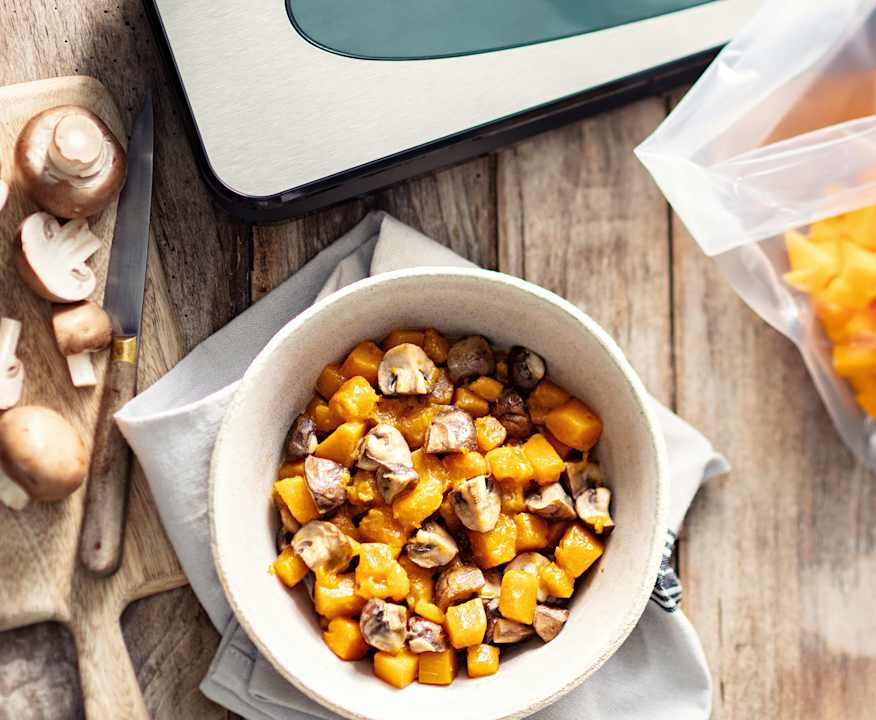

# Accompagnement de légumes d'automne sous-vide

**Difficulté :** Facile | **Temps actif :** 10 min | **Temps total :** 1h20 | **Portions :** 2 portions

**Catégorie :** Accompagnement

## Ustensiles

- sac sous-vide alimentaire
- machine sous-vide

## Ingrédients

- 1500 g d'eau
- 2 pincées de sel
- 200 g de champignons de Paris blonds (coupés en deux ou quatre)
- 200 g de courge butternut (détaillée en dés)
- 2 pincées de poivre moulu
- 30 g de jus de citron

## Préparation

**1.** Mettre l'eau et le jus de citron dans le bol, puis chauffer {5 min/85°C/vitesse 1}. Pendant ce temps, mettre les champignons, la butternut, le sel et le poivre dans un sac sous-vide, en laissant environ 3 cm de libre à l'ouverture, puis le sceller à l'aide d'une machine sous-vide.

**2.** Mettre le sac scellé dans le bol et cuire {1 h/Sous-vide/85°C}. Servir les légumes nature ou poêlés avec du beurre, en accompagnement d'une viande ou d'un poisson.
