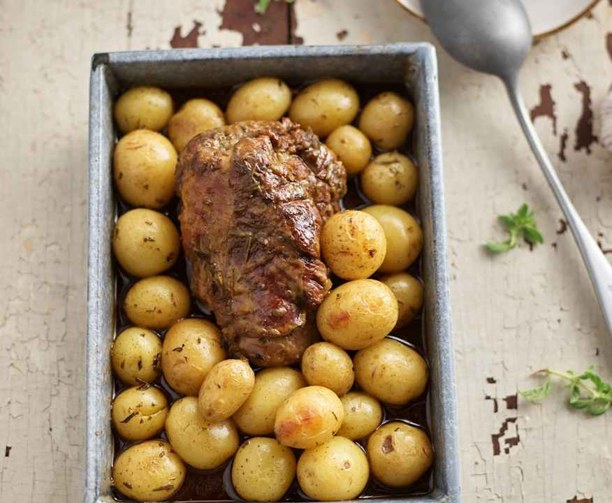

# Agneau à la méditerranéenne cuisson lente

**Difficulté :** Facile | **Temps actif :** 15 min | **Temps total :** 6h45 | **Portions :** 4 portions

**Catégorie :** Plat principal

## Ustensiles

- plat à four
- film alimentaire
- pince
- four

## Ingrédients

- 60 g d'ail
- quelques feuilles de romarin frais
- 90 g d'huile d'olive
- 800 g de gigot d'agneau désossé (en une seule pièce)
- 1 c. à café de sel
- 0,5 c. à café de poivre moulu
- 200 g d'oignons (coupés en quartiers)
- 1 c. à café de fond de viande
- 1 c. à café de paprika doux en poudre
- 500 g d'eau
- 500 g de pommes de terre nouvelles

## Préparation

**1.** Mettre 15 g d'ail, le romarin et 70 g d'huile d'olive dans le bol, puis hacher {3 sec/vitesse 8}. Racler les parois à l'aide de la spatule. Badigeonner toute la surface de l'agneau avec ce mélange, assaisonner de sel et de poivre, couvrir de film alimentaire et réserver.

**2.** Mettre les 20 g d'huile d'olive restants et les 45 g d'ail restants dans le bol, puis rissoler {3 min/120°C/mijotage} sans le gobelet doseur.

**3.** Ajouter les oignons et faire revenir {3 min/120°C/mijotage} sans le gobelet doseur.

**4.** Ajouter l'agneau mariné, le fond de viande, le paprika et l'eau, puis cuire {6 h/95°C/Cuisson lente}. Retirer l'agneau à l'aide d'une pince, le mettre dans un plat à four et réserver.

**5.** Insérer le panier cuisson, y mettre les pommes de terre, puis cuire {15 min/100°C/vitesse 2}. Pendant ce temps, préchauffer le four à 200°C. Retirer le panier, transvaser les pommes de terre dans le plat avec l'agneau, verser ¼ du jus de cuisson. Enfourner 15 minutes. Servir sans tarder.
