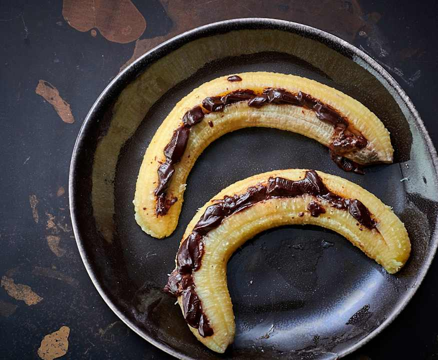

# Bananes cœur fondant

**Difficulté :** Facile | **Temps actif :** 5 min | **Temps total :** 20 min | **Portions :** 4 portions

**Catégorie :** Dessert

## Ingrédients

- 4 bananes bien mûres
- morceaux de chocolat
- 500 g d'eau
- QS amandes décortiquées (et concassées, pour la finition)

## Préparation

**1.** Inciser les bananes dans la longueur, insérer dans chacune 1-2 morceaux de chocolat, puis mettre 2 bananes dans le Varoma. Insérer le plateau vapeur et y mettre les 2 bananes restantes.

**2.** Mettre l'eau dans le bol. Mettre en place l'ensemble Varoma et cuire à la vapeur 12-{14 min/Varoma/vitesse 1}. Retirer l'ensemble Varoma et servir les bananes, parsemées d'amandes.
